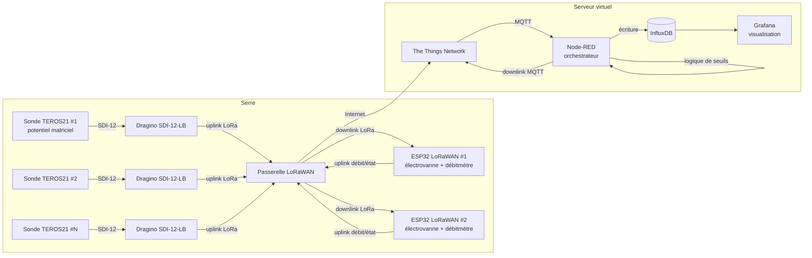

# 🌱 Irrigation de Précision LoRaWAN — Serre

Système d'irrigation de précision piloté par le potentiel matriciel du sol, inspiré du projet [Makerfabs IoT Irrigation System](https://github.com/Makerfabs/Project_IoT-Irrigation-System), adapté à une architecture LoRaWAN professionnelle.

## 📐 Architecture



## 🎯 Principe de fonctionnement

1. Chaque **sonde TEROS21** (METER Group) mesure le potentiel matriciel (kPa) et la température du sol.
2. Un convertisseur **Dragino SDI-12 → LoRaWAN** transmet les mesures via la passerelle LoRa de la serre vers **The Things Network (TTN)**.
3. **Node-RED** (orchestrateur sur serveur virtuel) reçoit les données par MQTT, les stocke dans **InfluxDB** et applique la logique d'irrigation :
   - potentiel matriciel < seuil sec → **ouverture** de l'électrovanne associée (downlink LoRaWAN)
   - potentiel matriciel > seuil humide OU volume max atteint → **fermeture**
4. Chaque **ESP32 LoRaWAN** pilote une électrovanne (1 vanne par sonde = irrigation zonale de précision) et compte les impulsions d'un **débitmètre** pour connaître l'apport d'eau exact.
5. **Grafana** affiche tensiométrie, volumes d'eau, états des vannes et alertes.

## 🔩 Matériel

| Élément | Référence | Rôle |
|---|---|---|
| Sonde tensiométrique | METER TEROS 21 | Potentiel matriciel + T° sol (SDI-12) |
| Convertisseur | Dragino SDI-12-LB / SDI-12-LS | SDI-12 → LoRaWAN, alimenté batterie |
| Passerelle | Passerelle LoRaWAN 868 MHz (serre) | Uplink/downlink vers TTN |
| Contrôleur vanne | ESP32 + module LoRaWAN (RFM95/SX1276) | Pilotage électrovanne + comptage débit |
| Électrovanne | 12/24 V (1 par sonde/zone) | Irrigation zonale |
| Débitmètre | À impulsions (ex. YF-S201, 1–30 L/min) | Mesure de l'apport d'eau |
| Serveur | VPS (Docker) | Node-RED + InfluxDB + Grafana |

## 📂 Structure du dépôt

```
firmware/esp32_valve_controller/   # Firmware PlatformIO ESP32 (vanne + débitmètre + LoRaWAN)
ttn/                               # Décodeurs de payload TTN (TEROS21, contrôleur vanne)
server/docker-compose.yml          # Stack Node-RED + InfluxDB + Grafana
server/nodered/                    # Flow d'orchestration (seuils, downlinks)
grafana/                           # Dashboard d'exemple
docs/images/                       # Photos et schémas du montage
```

## ⚙️ Seuils d'irrigation (exemple)

| Paramètre | Valeur par défaut | Description |
|---|---|---|
| `SEUIL_SEC` | −40 kPa | En dessous → démarrer irrigation |
| `SEUIL_HUMIDE` | −10 kPa | Au-dessus → arrêter irrigation |
| `VOLUME_MAX` | 10 L | Sécurité : volume max par cycle |
| `DUREE_MAX` | 15 min | Sécurité : durée max d'ouverture |

Les seuils sont configurables par zone dans Node-RED (`server/nodered/`).

## 🚀 Mise en route

1. **TTN** : créer une application, enregistrer les Dragino et les ESP32 (OTAA), coller les décodeurs de `ttn/`.
2. **Serveur** : `docker compose up -d` dans `server/`, configurer l'intégration MQTT TTN dans Node-RED.
3. **Firmware** : renseigner les clés OTAA dans `firmware/esp32_valve_controller/src/config.h`, compiler avec PlatformIO, flasher.
4. **Grafana** : importer `grafana/dashboard_irrigation.json`, pointer la datasource InfluxDB.

## 📸 Photos

Les photos du montage (sondes, vannes, passerelle, serre) sont dans `docs/images/` — *à compléter avec vos photos de terrain.*

## 📜 Licence

MIT — librement inspiré de [Makerfabs Project_IoT-Irrigation-System](https://github.com/Makerfabs/Project_IoT-Irrigation-System).
